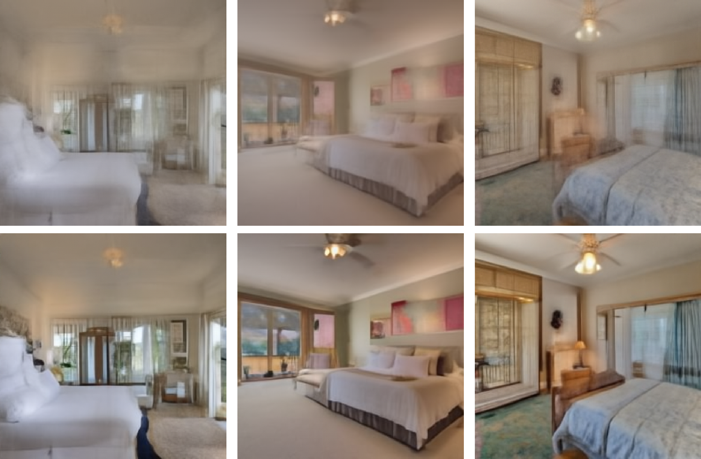
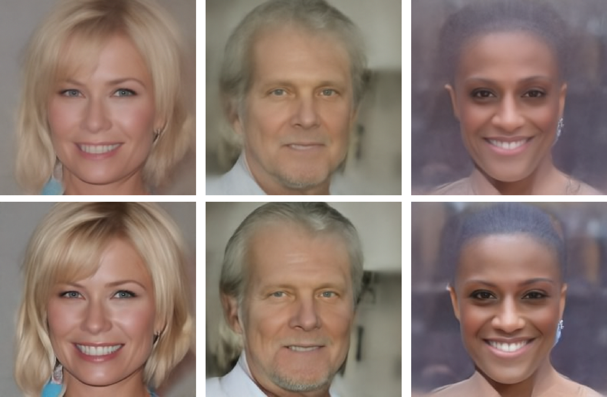
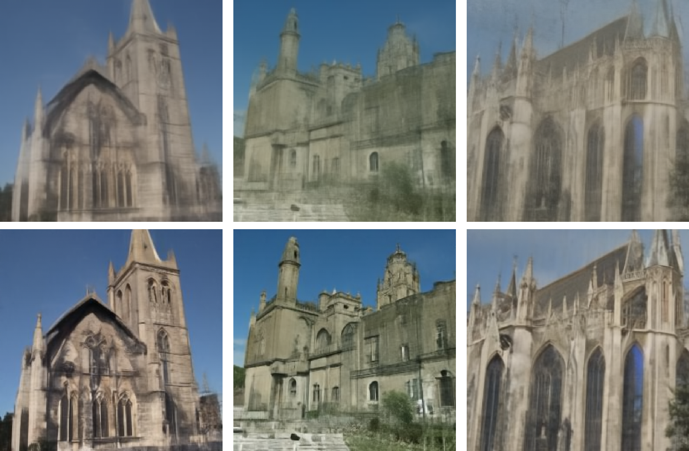
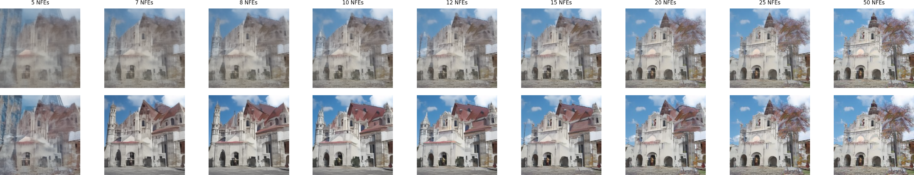

# Provably accelerated stochastic and deterministic diffusion model sampling:

This is github repository for the paper ["Accelerating convergence of score-based diffusion models, provably"](https://arxiv.org/abs/2403.03852), published at [ICML 2024(click for ICML version)](https://icml.cc/virtual/2024/poster/34352) 

This code is based on the codebases of: [Improved Denoising Diffusion Probabilistic Models](https://arxiv.org/abs/2102.09672), [DPM-Solver](https://github.com/LuChengTHU/dpm-solver), [DDIM codebase](https://github.com/ermongroup/ddim), and [Guided Diffusion](https://arxiv.org/abs/2105.05233)

<p>Visualization of the accelerated sampling (top rows are vanilla ODE sampler results, bottom row are accelerated ODE sampler results):</p>
<table>
  <tr>
    <td></td>
    <td></td>
    <td></td>
  </tr>
  <tr>
    <td colspan="3" align="center"></td>
  </tr>
</table>


## To run Accelerated SDE in Google Colab with GPU support
| Link | Description|
|:----:|:-----|
|[](https://colab.research.google.com/drive/1Y-lUCo5_M6H7HZSUhmXiu4yvWS68Ro4B#scrollTo=duxfFwfNFZwF)  | Run the code with cloud GPUs in Google Colab, Instructions are provided in the notebook |


# Accelerated SDE sampler 

The vanilla SDE samplers has convergence rate of $O(1/\sqrt{T})$: and read as the following:

$$
\begin{equation}
    Y_{t-1}=\frac{1}{\sqrt{\alpha_{t}}}\Big(Y_{t}+(1-\alpha_{t})s_{t}(Y_{t})+\sqrt{1-\alpha_{t}}Z_{t}\Big),  \quad t=T,\dots,1
\end{equation}
$$

Our proposed **accelerated SDE** sampling has the improved convergence rate of $O(1/T)$ and adopts the following update rule:

$$
\begin{align} 
    Y_{t}^+ &= \Phi_t(Y_t,Z_t), \\
    Y_{t-1} &= \Psi_t(Y_t^+, Z_t^+) 
\end{align}
$$

where

$$
\begin{align}
    t &= T, \ldots, 1, \\
    Z_t, Z_t^+ &\sim \mathcal{N}(0, I_d) \quad \text{i.i.d.}
\end{align}
$$

Where the two steps of the sampling are defined as follows: <br>

$$
\begin{align}
    \Phi_t(x,z) &= x + \sqrt{\frac{1 - \alpha_t}{2}} z, \\
    \Psi_{t}(y,z) &= \frac{1}{\sqrt{\alpha_{t}}}\bigg(y + (1-\alpha_{t})s_t(y)\bigg) + \sqrt{\frac{1 - \alpha_t}{2}} z.
\end{align}
$$


# Accelerated ODE sampler 

The formula for Vanilla ODE sampler with the convergence rate of convergence rate of $O(1/T)$

$$
\begin{align} & X(\overline{\alpha_{t-1}}) \approx \frac{1}{\sqrt{\alpha_{t}}}X(\overline{\alpha_{t}}) + \left(\sqrt{1-\overline{\alpha_{t-1}}}-\frac{\sqrt{1-\overline{\alpha_{t}}}}{\sqrt{\alpha_{t}}}\right)\epsilon_{t}(X_{t}) \end{align}
$$


The formula for Accelerated ODE sampler with improved theoretical convergence rate of $O(1/T^2)$

$$
\begin{align} & X(\overline{\alpha_{t-1}}) \approx \frac{1}{\sqrt{\alpha_{t}}}X(\overline{\alpha_{t}}) + \left(\sqrt{1-\overline{\alpha_{t-1}}}-\frac{\sqrt{1-\overline{\alpha_{t}}}}{\sqrt{\alpha_{t}}}\right)\epsilon_{t}(X_{t}) \ + \left(\frac{\sqrt{\overline{\alpha_{t-1}}}}{\overline{\alpha_{t}} - \overline{\alpha_{t+1}}}\right)\left(\overline{\alpha_{t}}\frac{\sqrt{1-\overline{\alpha_{t-1}}}}{\sqrt{\overline{\alpha_{t-1}}}} + \arcsin\sqrt{\overline{\alpha_{t-1}}}  - \overline{\alpha_{t}}\frac{\sqrt{1-\overline{\alpha_{t}}}}{\sqrt{\overline{\alpha_{t}}}} - \arcsin\sqrt{\overline{\alpha_{t}}}\right)(\epsilon_{t+1}(X_{t+1})-\epsilon_{t}(X_{t})). \end{align}
$$


# Usage

The code uses two different codebases, one for Accelerated SDE only which uses ImageNet-64 score function and another for both Accelerated SDE and ODE which uses CIFAR score function. Above you can find the link to the Google Colab notebook with instructions to run the Accelerated SDE code with FID computation using public Google GPU resources.  

# Usage for ImageNet-64 score function:


Install the environment given as .yml file. Sample.sh file runs the code, to make it executable, run chmod +x sample.sh command in the terminal. The accel flag in sample.sh determines whether accelerated or normal stochastic sampling is being run. To change number of sampled images do into scripts/new_image_sample.py and in the end change the number of images and batch size(50,000 and 500 correspondingly for benchmarking). For testing I used 10 for both of these values. All the terminal outputs are saved into a text file in a folder specified in sample.sh. After sampling is done run fidEval.sh for computing FID scores(works for larger amount of images only). In fidEval.sh change the path to the folder in which sampled images are for which you compute the FID score. The FID score is going to be saved in the same directory as images in .txt file inside fid subfolder. 


* Install the environment given as .yml file, using command
```
conda env create -f environment.yml'
conda activate impr 
pip install -e .
```

* To activate the bash file, run in the terminal
```
chmod +x sample.sh 
```
* Place the weights into some folder inside you codebase, can be downloaded for ImageNet-64 [here](https://github.com/LuChengTHU/dpm-solver/tree/main/examples/ddpm_and_guided-diffusion), as well pre-computed FID statistics

* Inside sample.sh change the directory to which you want to save the files, accel flag determines whether you want to run accelerated or vanilla version.
    * Inside sample.sh also change the GPU you want to use and in the last line change the path to the weights.
    * Inside scripts/new_image_sample.py in very end you can control batch size and overall number of samples. For benchmarking we used 500 and 50,000 correspondingly and 10 and 10 for testing purposes.

* For FID computation, similarly run

```
chmod +x fidEVal.sh 
```

* Inside fidEval.sh, change the location of the fid statistics that you can download for ImageNet-64 [here](https://github.com/LuChengTHU/dpm-solver/tree/main/examples/ddpm_and_guided-diffusion). Also change for which directories you want to compute FID scores.


# Usage for Cifar-10 score function:

* Install the environment given as .yml file, using command
```
conda env create -f environment.yml'
conda activate DPM
```

* Need to run the following

```
chmod +x newSample.sh 
```

* Similar to the previous codebase, download the weights for CIFAR [here](https://github.com/LuChengTHU/dpm-solver/tree/main/examples/) according to their instructions. 

* Inside newSample.sh, change the GPU, the sample Method(out of vanilla SDE, accelerated SDE, vanilla ODE, and accelerated ODE). All the output is saved to .txt file at the path you specified. 